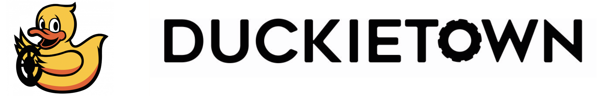

### Autonomous Mobility on Demand - Fall 2019

     

# proj-lf-adaptive 

# Adaptive lane following 

> **"Ab uno disce omnes"**   
> "From one learn it all" 

Authors | Contact | Mentors | Supervisor
------- | ------- | ------- | -----------
Pietro Griffa | griffap@student.ethz.ch | Rohit Suri | Jacopo Tani
Simone Arreghini | arsimone@student.ethz.ch | Aleksandar Petrov | 

Authors:
* Pietro Griffa          &nbsp; &nbsp; &nbsp; &nbsp; &nbsp; &nbsp; &nbsp; &nbsp; &nbsp; griffap@student.ethz.ch
* Simone Arreghini       &nbsp; &nbsp; &nbsp; &nbsp; arsimone@student.ethz.ch

Mentors:
* Rohit Suri
* Aleksandar Petrov

Supervisor:
* Jacopo Tani

## Mission 

The goal of the project is to design an Adaptive Controller that allows the estimation of the trim kinematic parameter of a Duckiebot, everything done while performing lane following driving around the city.

The objective is then to identify reliably the trim of a Duckiebot after a short period of standard lane following, starting from an arbitrary initial value. This is done with the aim of getting rid of the manual odometry calibration which is now a  periodic necessary practice to have an acceptable behavior from a Duckiebot.

# Structure 

The folder `packages` groups together the Adaptive Controller package that has been introduced as a new functionality, and others that have been modified to improve the performances of the lane following.

The folder `matlab_simulator` collects all the code necessary to run the simulator that was implemented to test different possible control architecture. More details can be found in the relative ReadMe.

Finally, in the folder `scripts` there are some scripts that can be used as shortcuts to quickly start the demo and perform some data analysis.

# Demo 

## Requirements 

1. Laptop configured, according to [Unit C-1 - Laptop Setup](https://docs.duckietown.org/daffy/opmanual_duckiebot/out/laptop_setup.html).

Requires: A Duckiebot in `DB18` configuration.

2. You have configured the Duckiebot as documented in [Unit C-5 - Duckiebot Initialization](https://docs.duckietown.org/daffy/opmanual_duckiebot/out/setup_duckiebot.html).

3. [Camera calibration](https://docs.duckietown.org/daffy/opmanual_duckiebot/out/camera_calib.html) completed.

**Results:** Make you duckiebot self-calibrate.

## Duckiebot setup 

All that is required is to have a Duckiebot in DB18 configuration whose camera as already been calibrated as described in [Camera calibration](https://docs.duckietown.org/daffy/opmanual_duckiebot/out/camera_calib.html).

## Duckietown setup 

No specific setup of the city is required. However, to have faster convergence, it is advisable to run the demo in a city map with as many long straight segment as possible.
The lane following pipeline used, likewise the standard lane following, does not take into account intersections therefore its behavior will be unpredictable in their presence and might cause the Duckiebot to go out of the lane.

## Instructions 

To run this demo there are two way of proceeding, using manual commands or using the scripts provided in the relative folder.

Let's start from the first one, using single commands:

1. Clone the repository in the desired position and move into it:  

       laptop $ git clone https://github.com/duckietown-ethz/proj-lf-adaptive  
       laptop $ cd proj-lf-adaptive

2. Start all the necessary demos, in another terminal from the previous one:
* demo all_driver and demo all, similarly as you would do for [Unit E-2 Lane following](https://docs.duckietown.org/daffy/opmanual_duckiebot/out/demo_lane_following.html)  
 Warning: Before running the following commands make sure that all the old containers from the images dt-duckiebot-interface, dt-car-interface and dt-core are stopped.  
 Start the demo all_driver which builds upon `dt-duckiebot-interface` and gives us all the necessary drivers:
 
        laptop $ dts duckiebot demo --demo_name all_drivers --duckiebot_name [DUCKIEBOT_NAME] --package_name duckiebot_interface --image duckietown/dt-duckiebot-interface:daffy  

  Start the demo all which builds upon `dt-duckiebot-interface` and handles the joystick mapping and the kinematics:  

        laptop $ dts duckiebot demo --demo_name all --duckiebot_name [DUCKIEBOT_NAME] --package_name car_interface --image duckietown/dt-car-interface:daffy  

* Finally, the virtual joystick container using:

        dts duckiebot keyboard_control [DUCKIEBOT_NAME] --base_image duckietown/dt-core:daffy-amd64
      
 Recommended: Before proceeding to the next step make sure all the necessary demos are running as in some cases they might stop just after launching. 

3. Start a container based on dt-ros-commons on you pc connected to the rosmaster of the Duckiebot. This will allow you to set some useful parameters for this demo:

Build the image on the Duckiebot by running the command:

    build command

Run the container with the command:

    run command

   

## Troubleshooting 

