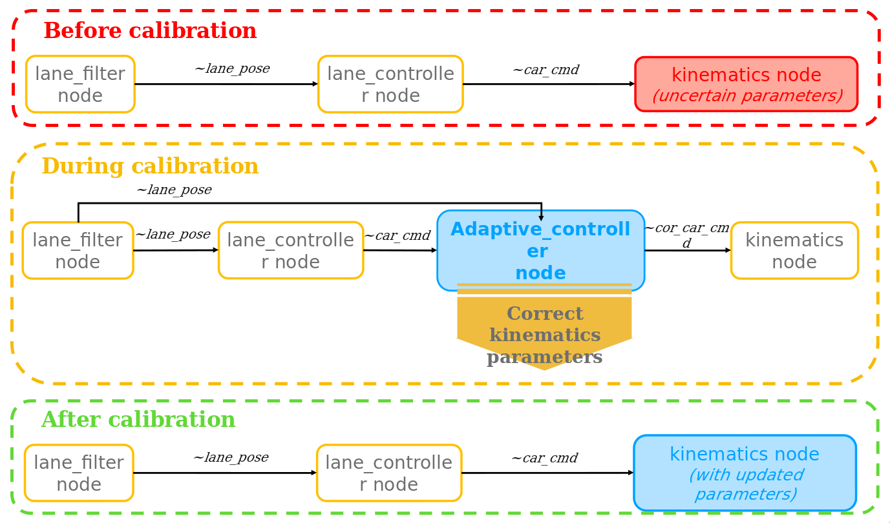
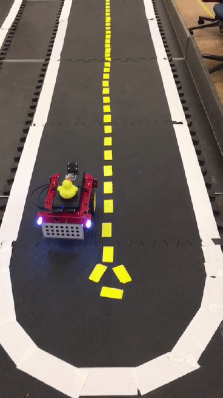
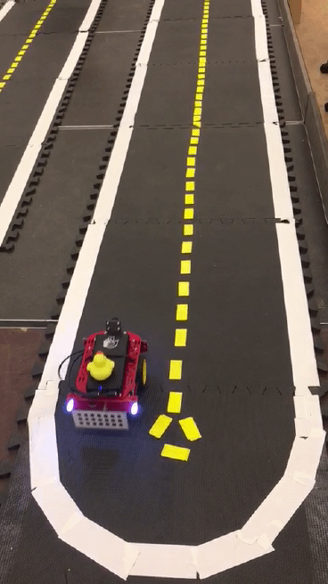

### Autonomous Mobility on Demand - Fall 2019

     

# proj-lf-adaptive 

# Adaptive lane following 

> **"Ab uno disce omnes"**   
> "From one learn it all" 

Authors:
* Pietro Griffa          &nbsp; &nbsp; &nbsp; &nbsp; &nbsp; &nbsp; &nbsp; &nbsp; &nbsp; griffap@student.ethz.ch
* Simone Arreghini       &nbsp; &nbsp; &nbsp; &nbsp; arsimone@student.ethz.ch

Mentors:
* Rohit Suri
* Aleksandar Petrov

Supervisor:
* Jacopo Tani

## 1. Mission 

The goal of the project is to design an Adaptive Controller that allows the estimation of the trim kinematic parameter of a Duckiebot, everything done while performing lane following driving around the city.

The objective is then to identify reliably the trim of a Duckiebot after a short period of standard lane following, starting from an arbitrary initial value. This is done with the aim of getting rid of the manual odometry calibration which is now a  periodic necessary practice to have an acceptable behavior from a Duckiebot.

<h4 style="text-align:center;"> Conceptual Functioning Scheme </h4>

     

## 2. Structure 

The folder `packages` groups together the Adaptive Controller package that has been introduced as a new functionality, and others that have been modified to improve the performances of the lane following.

The folder `matlab_simulator` collects all the code necessary to run the simulator that was implemented to test different possible control architecture. More details can be found in the relative ReadMe.

Finally, in the folder `scripts` there are some scripts that can be used as shortcuts to quickly start the demo and perform some data analysis.

## 3. Demo 

### 3.1 Requirements 

:o: Laptop configured, according to [Unit C-1 - Laptop Setup](https://docs.duckietown.org/daffy/opmanual_duckiebot/out/laptop_setup.html).

:o: Requires: A Duckiebot in `DB18` configuration.

:o: You have configured the Duckiebot as documented in [Unit C-5 - Duckiebot Initialization](https://docs.duckietown.org/daffy/opmanual_duckiebot/out/setup_duckiebot.html).

:o: Successful completion of [Unit C-11 - Camera calibration and validation](https://docs.duckietown.org/daffy/opmanual_duckiebot/out/camera_calib.html).

:heavy_check_mark: **Results:** Self-calibration of the Duckiebot trim parameter.

### 3.2 Expected Results

The goal is to self-calibrate a poorly calibrated Duckiebot like the following one:

     

Ending, after this procedure, with a better calibrated unit, like:

     

### 3.3 Duckiebot setup 

All that is required is to have a Duckiebot in DB18 configuration whose camera as already been calibrated as described in [Camera calibration](https://docs.duckietown.org/daffy/opmanual_duckiebot/out/camera_calib.html).

### 3.4 Duckietown setup 

No specific setup of the city is required. However, to have faster convergence, it is advisable to run the demo in a city map with as many long straight segment as possible.
The lane following pipeline used, likewise the standard lane following, does not take into account intersections therefore its behavior will be unpredictable in their presence and might cause the Duckiebot to go out of the lane.

### 3.5 Instructions 

To run this demo there are two way of proceeding, using manual commands or using the scripts provided in the relative folder. In this demo three terminals are needed, so before each command is specified the right terminal in which run the command. 

##### Let's start from the first one, using single commands:

1. Clone the repository in the desired position and move into it:  

       terminal 1 $ git clone https://github.com/duckietown-ethz/proj-lf-adaptive  
       terminal 1 $ cd proj-lf-adaptive

2. In the second terminal, start all the necessary demos:
* demo all_driver and demo all, similarly as you would do for [Unit E-2 - Lane following](https://docs.duckietown.org/daffy/opmanual_duckiebot/out/demo_lane_following.html)  
 :heavy_exclamation_mark: **Warning:** Before running the following commands make sure that all the old containers from the images dt-duckiebot-interface, dt-car-interface and dt-core are stopped.  
 Start the demo all_driver which builds upon `dt-duckiebot-interface` and gives us all the necessary drivers:
 
        terminal 2 $ dts duckiebot demo --demo_name all_drivers --duckiebot_name [DUCKIEBOT_NAME] --package_name duckiebot_interface --image duckietown/dt-duckiebot-interface:daffy  

  Start the demo all which builds upon `dt-duckiebot-interface` and handles the joystick mapping and the kinematics:  

        terminal 2 $ dts duckiebot demo --demo_name all --duckiebot_name [DUCKIEBOT_NAME] --package_name car_interface --image duckietown/dt-car-interface:daffy  

* Finally, the virtual joystick container using:

        terminal 2 $ dts duckiebot keyboard_control [DUCKIEBOT_NAME] --base_image duckietown/dt-core:daffy-amd64
  
  As explained also in [Unit C-9 - Making your Duckiebot move](https://docs.duckietown.org/daffy/opmanual_duckiebot/out/rc_control.html) the virtual joystick will pop up. It will be necessary at the end to start the demo.
      
 :heavy_exclamation_mark: **Recommended:** Before proceeding to the next step make sure all the necessary demos are running with the help of the [Portainer](https://docs.duckietown.org/daffy/duckietown-robotics-development/out/basic_db_operation.html), as in some cases they might unpredictably stop just after launching. 

3. Again in the first terminal, build the image of the Adaptive Controller pipeline and start the container on the Duckiebot. It is a modified version of dt-core and will run every necessary node for the lane following.

* Build the image on the Duckiebot by running the command in the main folder of the repository:
              
        terminal 1 $ dts devel build --ignore-watchtower -f --arch arm32v7 -H [DUCKIEBOT_NAME].local

* Then start the container on the Duckiebot with the command:

        terminal 1 $ docker -H [DUCKIEBOT_NAME].local run -it -v /data:/data --rm --net=host duckietown/proj-lf-adaptive:master-arm32v7

4. In the third terminal, run a container and attach a bash to it to allow the usage of ROS from your pc. This container will be connected to the rosmaster running on the Duckiebot and from here you will be able to set some useful parameters for this demo:
       
        terminal 3 $ docker run -it --rm  -e ROS_MASTER_URI='http://[DUCKIEBOT_IP]/' duckietown/dt-ros-commons:daffy-amd64 /bin/bash
 
   In this container bash, run the above commands that set some  ROS parameters that halp improving stability of the lane following algorithm:
       
        terminal 3 bash $ rosparam set /[DUCKIEBOT_NAME]/lane_controller_node/omega_max 4.7
        terminal 3 bash $ rosparam set /[DUCKIEBOT_NAME]/lane_controller_node/omega_min -4.7
   
   The setting of the initial trim estimate is recommended to be set to 0.0 but this should not effect the outcome of the calibration. You can do that using:
   
        terminal 3 bash $ rosparam set /[DUCKIEBOT_NAME]/kinematics_node/trim 0.0
   
   Optionally, there are other changeable parameter whose effect are explained in the file [/scripts/good_params](https://github.com/duckietown-ethz/proj-lf-adaptive/blob/master/scripts/good_params). Have a look to this file to be able to get best performance from this demo.
   
5. Finally, likewise the standard lane following you can start the demo by pressing 'a' button on the keyboard while having the virtual joystick selected as current tab.  
 The demo should start and in the first terminal you should be able to see ROS logs with some useful variables in output.
 
6. Wait for the calibration to finish and upon convergence the Duckiebot should stop and the control should be back to the virtual joystick. During this process the calibration yaml file will be permanently updated with the new estimated trim value, in order to retain it between successive boot of the Duckiebot.  
 Now you can either choose to drive your Duckiebot back manually or press again the 'a' button on the virtual joystick and start the standard lane following with updated parameter that will up and running automatically. 
 
##### Using the scripts:

The scripts are no other than bash files that semplify this procedure for the points 2 and 3. You can find them in the [proj-lf-adaptive/scripts/](https://github.com/duckietown-ethz/proj-lf-adaptive/tree/master/scripts) folder and to use them you just need to open and change **<YOUR_DUCKIEBOT_NAME>** in the third row in your real hostname and save.

All the point besides 2 and 3 stay the same so they won't be repeated.

2. In the second terminal, after having modified the scripts, start all the necessary demos (demo all, demo all_drivers and the virtual joystick) by running:  
  :heavy_exclamation_mark: **Warning:** Before running the following commands make sure that all the old containers from the images dt-duckiebot-interface, dt-car-interface and dt-core are stopped.

       terminal 1 $ ./scripts/launch_demos
      
  :heavy_exclamation_mark: **Recommended:** As with the normal procedure, before going on to the next step make sure all the necessary demos are running with the help of the [Portainer](https://docs.duckietown.org/daffy/duckietown-robotics-development/out/basic_db_operation.html), as in some cases they might unpredictably stop just after launching.
 
3. Again the first terminal, build the image of the Adaptive Controller pipeline and start the container on the Duckiebot. It is a modified version of dt-core and will run every necessary node for the lane following.

   Build the image on the Duckiebot and start the container on the Duckiebot with the command:

        terminal 1 $ ./scripts/build_and_run
        
    
### 3.6 Troubleshooting 

**Symptom:** Lane following does not start.

Solution: Check if all the required demos are up and running.

**Symptom:** Duckiebot go out of the lane during calibration.

Solution: When this happen or is about to happen you can regain control of the Duckiebot by pressing the 's' button on the virtual joystick, straighten the Duckiebot with respect to the lane and press 'a' button to resume lane following. This does not effect the quality of the calibration as the update of the adaptive parameter is inhibited when either the Duckiebot is controlled with the joystick or some anomalies are found in the pipeline.

**Symptom:** Duckiebot fail to stop after convergence.

Solution: It might happen that sometimes the Duckiebot does not stop after convergence even if the lane following in turned off. This will cause the Duckiebot to eventually go out of the lane as a constant wheel_cmd is being applied. In this case just press the 's' button on the virtual joystick to stop the Duckiebot and you will find yourself as the Duckiebot stopped itself, with the yaml file updated and standard lane following up and running.
